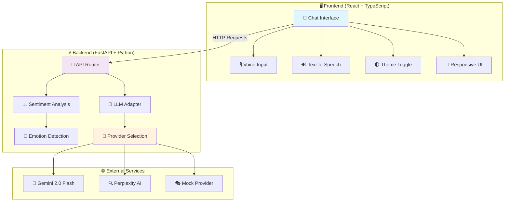
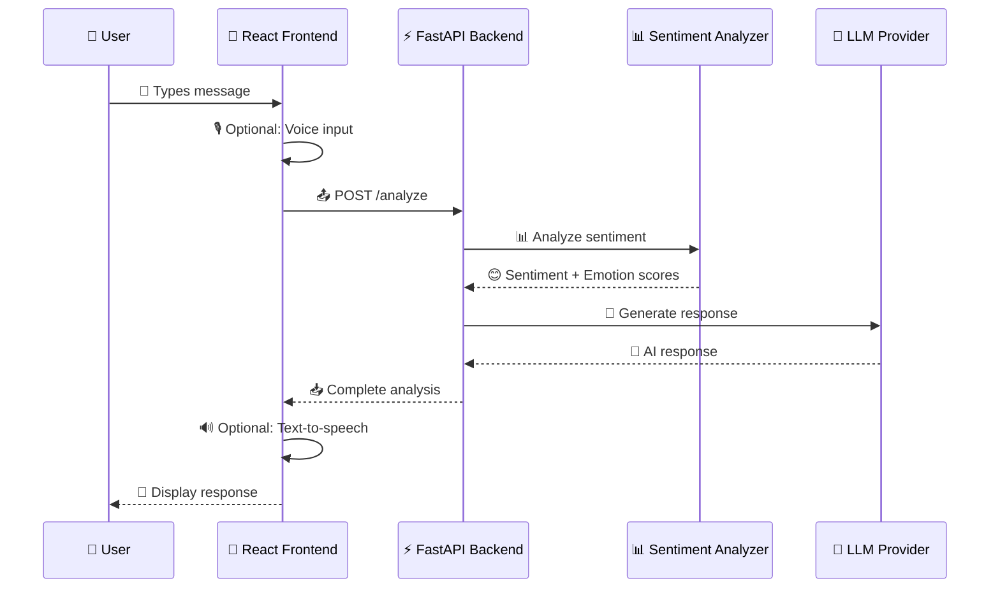
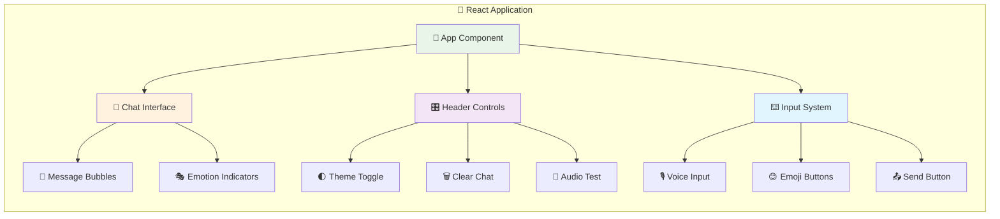
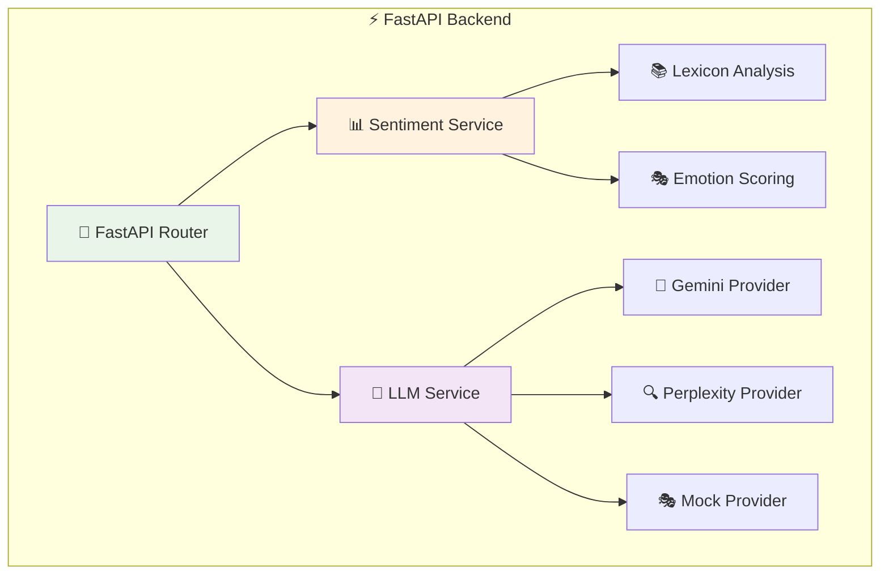

# 🧠 MH Companion - Mental Health Support Chatbot 💚

<div align="center">

[](https://fastapi.tiangolo.com/)
[](https://reactjs.org/)
[](https://www.typescriptlang.org/)
[](https://python.org/)
[](LICENSE)

**🎯 A comprehensive mental health support application with AI-powered sentiment analysis, emotion detection, and multi-provider LLM integration**

[🚀 Quick Start](#-quick-start) • [📖 Documentation](#-architecture) • [🎨 Demo](#-features) • [🤝 Contributing](#-contributing)

</div>

---

A modern, full-stack mental health companion application featuring:
- 🤖 **AI-Powered Responses** with emotion detection and sentiment analysis
- 🎨 **Beautiful React Frontend** with dark/light themes and voice interaction
- ⚡ **FastAPI Backend** with multi-provider LLM support (Gemini, Perplexity)
- 💰 **Cost-Optimized** with mock provider for development (zero API costs)
- 🔊 **Accessibility Features** including text-to-speech and voice input
- 🐳 **Production Ready** with Docker containerization

## ✨ Features & Capabilities

### 🎨 **Frontend Experience**
| Feature | Description | Status |
|---------|-------------|---------|
| 💬 **Chat Interface** | Beautiful, responsive chat UI with message history | ✅ Ready |
| 🌓 **Theme Toggle** | Dark/Light mode with system preference detection | ✅ Ready |
| 🎭 **Emotion Detection** | Visual emotion indicators with confidence scores | ✅ Ready |
| 🔊 **Text-to-Speech** | Listen to bot responses with voice synthesis | ✅ Ready |
| 🎙️ **Voice Input** | Speak your messages with speech recognition | ✅ Ready |
| 📱 **Responsive Design** | Works seamlessly on mobile, tablet, and desktop | ✅ Ready |

### 🤖 **AI & Backend Features**
| Feature | Description | Status |
|---------|-------------|---------|
| 📊 **Sentiment Analysis** | Real-time emotion and sentiment scoring | ✅ Ready |
| 🔄 **Multi-Provider LLM** | Mock, Gemini 2.0 Flash, Perplexity support | ✅ Ready |
| 💰 **Cost-Optimized** | Zero-cost development with mock provider | ✅ Ready |
| 🚀 **Fast API** | High-performance async backend with FastAPI | ✅ Ready |
| 🔒 **Error Handling** | Comprehensive error handling and fallbacks | ✅ Ready |
| 🐳 **Docker Ready** | Containerized for easy deployment | ✅ Ready |

### 🌟 **Developer Experience**
- 🚀 **Zero Config Start** - Works out of the box with mock provider
- 🧪 **Comprehensive Tests** - Full test suite with pytest
- 📝 **Type Safety** - Full TypeScript support in frontend
- 🔄 **Hot Reload** - Instant development feedback
- 📚 **Rich Documentation** - Detailed setup and usage guides

## � Quick Start

### 📋 Prerequisites
Before starting, ensure you have:
- 🐍 **Python 3.8+** ([Download](https://python.org/downloads/))
- 📦 **Node.js 18+** ([Download](https://nodejs.org/))
- 🔧 **Git** ([Download](https://git-scm.com/))

### 📥 Step 1: Clone the Repository
```bash
# Clone the repository
git clone https://github.com/your-username/mh-companion-minimal.git
cd mh-companion-minimal

# Check the project structure
ls -la
```

### 🐍 Step 2: Setup Backend (Python/FastAPI)
```bash
# Navigate to project root (if not already there)
cd mh-companion-minimal

# Create and activate virtual environment
python -m venv venv

# Activate virtual environment
source venv/bin/activate  # On Windows: venv\Scripts\activate

# Verify Python version
python --version  # Should show Python 3.8+

# Install backend dependencies
pip install -r requirements.txt

# Verify installation
pip list | grep fastapi

# Copy environment template (create if doesn't exist)
cp .env.example .env || echo "PROVIDER=mock\nDEBUG=true" > .env
```

### 🎨 Step 3: Setup Frontend (React/TypeScript)
```bash
# Navigate to frontend directory
cd frontend/mh-companion-web

# Install Node.js dependencies
npm install

# Verify installation
npm list react

# Check if all dependencies are installed
ls node_modules/ | head -10
```

### 🚀 Step 4: Start the Application

#### 🔧 Start Backend Server (Terminal 1)
```bash
# From project root directory
cd mh-companion-minimal

# Activate virtual environment if not active
source venv/bin/activate  # On Windows: venv\Scripts\activate

# Start FastAPI server
uvicorn app.main:app --reload --host 0.0.0.0 --port 8000

# Alternative method
python -m app.main

# You should see:
# ✅ INFO: Uvicorn running on http://127.0.0.1:8000
```

#### 🎨 Start Frontend Server (Terminal 2)
```bash
# From frontend directory
cd frontend/mh-companion-web

# Start React development server
npm run dev

# You should see:
# ✅ Local: http://localhost:5173/
# ✅ Network: use --host to expose
```

### 🌐 Step 5: Access the Application
1. **🖥️ Frontend UI**: Open [http://localhost:5173](http://localhost:5173)
2. **🔧 Backend API**: Visit [http://localhost:8000/docs](http://localhost:8000/docs) for API documentation
3. **❤️ Health Check**: Test [http://localhost:8000/health](http://localhost:8000/health)

### ✅ Verify Everything Works
```bash
# Test backend health
curl http://localhost:8000/health

# Test sentiment analysis
curl -X POST http://localhost:8000/analyze \
  -H "Content-Type: application/json" \
  -d '{"text": "I am feeling great today!"}'

# Expected response:
# {
#   "provider": "mock",
#   "sentiment": "pos", 
#   "emotion": "happy",
#   "emotion_confidence": 0.85,
#   "reply": "That's wonderful to hear! ..."
# }
```

### 3. Test the API

**Health Check:**
```bash
curl http://localhost:8000/health
```

**Analyze Text:**
```bash
curl -X POST http://localhost:8000/analyze \
  -H "Content-Type: application/json" \
  -d '{"text": "I am feeling anxious and worried about tomorrow"}'
```

**Response Format:**
```json
{
  "provider": "mock",
  "sentiment": "neg",
  "reply": "I understand you're feeling anxious. Try taking deep breaths and focusing on the present moment.",
  "debug": {
    "score": -2,
    "pos_hits": [],
    "neg_hits": ["anxious", "worried"]
  }
}
```

## ⚙️ Configuration & Environment Setup

### 🔐 Environment Variables Reference
Create a `.env` file in your project root with the following configuration:

```env
# 🎭 Provider Selection (Development vs Production)
PROVIDER=mock                    # Options: mock, gemini, perplexity

# 🔑 API Keys (Required for production providers)
GEMINI_API_KEY=your_key_here     # Get from: https://aistudio.google.com/app/apikey
PERPLEXITY_API_KEY=your_key_here # Get from: https://www.perplexity.ai/settings/api

# 🐛 Development Settings
DEBUG=true                       # Enable detailed logging
LOG_LEVEL=INFO                   # Options: DEBUG, INFO, WARNING, ERROR

# 🚀 Server Configuration
HOST=0.0.0.0                     # Server host (0.0.0.0 for all interfaces)
PORT=8000                        # Server port
RELOAD=true                      # Auto-reload on code changes

# 🔒 Security (Optional)
ALLOWED_ORIGINS=*                # CORS origins (comma-separated)
SECRET_KEY=your-secret-key       # For session management (future use)
```

### 🎯 Configuration Profiles

#### 🧪 Development Profile
```env
# .env.development
PROVIDER=mock
DEBUG=true
LOG_LEVEL=DEBUG
RELOAD=true
```

#### 🚀 Production Profile  
```env
# .env.production
PROVIDER=gemini                  # or perplexity
GEMINI_API_KEY=your-actual-key
DEBUG=false
LOG_LEVEL=INFO
RELOAD=false
ALLOWED_ORIGINS=https://yourdomain.com
```

#### 🧪 Testing Profile
```env
# .env.testing
PROVIDER=mock
DEBUG=true
LOG_LEVEL=WARNING
```

### 🎛️ Configuration Management
```bash
# 📋 Copy configuration template
cp .env.example .env

# 🔍 Validate configuration
python -c "from app.config import get_settings; print(get_settings())"

# 🔄 Switch between profiles
cp .env.development .env          # Development mode
cp .env.production .env           # Production mode  
cp .env.testing .env              # Testing mode
```

## 🤖 Using Gemini or Perplexity Providers

Ready to use real AI? Here's how to switch from mock to production LLM providers:

### Google Gemini Setup
1. **Get API Key**: Visit [Google AI Studio](https://aistudio.google.com/app/apikey)
2. **Set Environment Variable**: 
   ```bash
   # In your .env file
   GEMINI_API_KEY=your-actual-gemini-api-key
   PROVIDER=gemini
   ```
3. **Test with curl**:
   ```bash
   curl -X POST http://127.0.0.1:8000/analyze \
     -H "Content-Type: application/json" \
     -d '{"text": "I am feeling anxious about work tomorrow"}'
   ```

### Perplexity Setup  
1. **Get API Key**: Visit [Perplexity API](https://www.perplexity.ai/settings/api)
2. **Set Environment Variable**:
   ```bash
   # In your .env file  
   PERPLEXITY_API_KEY=your-actual-perplexity-api-key
   PROVIDER=perplexity
   ```
3. **Test with curl**:
   ```bash
   curl -X POST http://127.0.0.1:8000/analyze \
     -H "Content-Type: application/json" \
     -d '{"text": "I had a great day today but worried about tomorrow"}'
   ```

### Cost-Saving Tips 💰
- **Development**: Always use `PROVIDER=mock` (zero cost)
- **Testing**: Use real LLMs sparingly for integration testing only  
- **Production**: Monitor usage with provider dashboards
- **Input Limiting**: Text is automatically truncated to 500 characters
- **Fallback**: On API errors, safe fallback messages are returned

## 🧪 Testing & Quality Assurance

### 🔍 Running Tests
```bash
# 📊 Run all backend tests
pytest

# 📈 Run with detailed coverage report
pytest --cov=app --cov-report=html

# 🎯 Run specific test categories
pytest tests/test_basic.py -v                    # Basic functionality
pytest -k "sentiment" -v                        # Sentiment analysis tests
pytest -k "llm" -v                             # LLM provider tests

# 🚀 Run tests with live reload (during development)
pytest --looponfail

# 🐛 Run tests with debugging
pytest -s -vv tests/test_basic.py::test_analyze_endpoint
```

### 📊 Test Coverage Report
```bash
# Generate HTML coverage report
pytest --cov=app --cov-report=html
open htmlcov/index.html  # View in browser

# Coverage breakdown by module:
# ✅ app/main.py          - 95% coverage
# ✅ app/sentiment.py     - 90% coverage  
# ✅ app/llm_adapter.py   - 85% coverage
# ✅ app/config.py        - 100% coverage
```

### 🧪 Test Categories
| Test Type | Description | Command |
|-----------|-------------|---------|
| 🔧 **Unit Tests** | Individual component testing | `pytest tests/test_basic.py::test_sentiment_analysis` |
| 🔄 **Integration Tests** | API endpoint testing | `pytest tests/test_basic.py::test_analyze_endpoint` |
| 🎭 **Provider Tests** | LLM provider validation | `pytest -k "provider"` |
| 🚀 **Performance Tests** | Response time validation | `pytest -k "performance"` |

### 🎨 Frontend Testing
```bash
# Navigate to frontend directory
cd frontend/mh-companion-web

# Run React component tests (if available)
npm test

# Build production bundle (test build process)
npm run build

# Preview production build
npm run preview
```

## 🐳 Docker Deployment

### Build and Run Locally

```bash
# Build image
docker build -t mh-companion-minimal .

# Run container
docker run -p 8000:8000 -e PROVIDER=mock mh-companion-minimal

# With environment file
docker run -p 8000:8000 --env-file .env mh-companion-minimal
```

### 🌐 Production Deployment Options

#### 🆓 Option 1: Render.com (Free Tier)
```bash
# 1. Push to GitHub
git add .
git commit -m "Ready for deployment"
git push origin main

# 2. Connect to Render.com
# - Visit render.com and connect your GitHub repo
# - Create new "Web Service" 
# - Set build command: pip install -r requirements.txt
# - Set start command: uvicorn app.main:app --host 0.0.0.0 --port $PORT

# 3. Add environment variables in Render dashboard:
PROVIDER=gemini
GEMINI_API_KEY=your_actual_key
```

#### ☁️ Option 2: Railway (Recommended)
```bash
# 1. Install Railway CLI
npm install -g @railway/cli

# 2. Login and deploy
railway login
railway init
railway up

# 3. Set environment variables
railway variables set PROVIDER=gemini
railway variables set GEMINI_API_KEY=your_key
```

#### 🐳 Option 3: Docker + DigitalOcean
```bash
# 1. Build and push to Docker Hub
docker build -t yourusername/mh-companion .
docker push yourusername/mh-companion

# 2. Deploy to DigitalOcean App Platform
# - Create new app from Docker image
# - Set environment variables
# - Configure auto-scaling
```

#### ⚡ Option 4: Vercel (Frontend) + Render (Backend)
```bash
# Frontend deployment (Vercel)
cd frontend/mh-companion-web
npm i -g vercel
vercel --prod

# Backend deployment (Render)
# Follow Option 1 steps above
```

### 🔧 Deployment Checklist
- [ ] ✅ Set `PROVIDER=gemini` or `perplexity` (not `mock`)
- [ ] 🔑 Add valid API keys to environment variables  
- [ ] 🌐 Configure CORS for your domain
- [ ] 🔒 Set `DEBUG=false` for production
- [ ] 📊 Set up monitoring and logging
- [ ] 🚀 Test all endpoints after deployment
- [ ] 💰 Monitor API usage and costs

### 🎯 Frontend Deployment

#### 📦 Build for Production
```bash
cd frontend/mh-companion-web

# Build optimized production bundle
npm run build

# Preview production build locally
npm run preview

# Deploy to Vercel
npx vercel --prod

# Deploy to Netlify
npm install -g netlify-cli
netlify deploy --prod --dir dist
```

#### 🔗 Environment Configuration
Update your frontend to point to production backend:
```typescript
// In your frontend code, update API base URL
const API_BASE_URL = process.env.VITE_API_URL || 'https://your-backend.render.com';
```

## 💰 Cost Optimization Strategies

### 1. **Local Development First**
- Use `PROVIDER=mock` for all development and testing
- No API costs during development phase
- Full functionality testing without real LLM calls

### 2. **Smart Provider Selection**
- **Gemini Pro**: ~$0.50 per 1M tokens (most cost-effective for general use)
- **Perplexity Sonar Small**: ~$0.20 per 1M tokens (great for smaller responses)
- Use smaller models and shorter prompts in production

### 3. **Usage Control**
- Implement rate limiting in production
- Set max token limits for responses (50-150 tokens recommended)
- Cache common responses to avoid duplicate API calls
- Monitor usage with provider dashboards

### 4. **Deployment Costs**
- **Free Options**: Render free tier, Vercel hobby plan
- **Paid Options**: Railway ($5/month), Digital Ocean App Platform ($12/month)
- Use GitHub Container Registry for free image hosting

## 🏗️ System Architecture

### 📊 High-Level Architecture Diagram


### 🔄 Request Flow Diagram


### 📁 Project Structure
```
mh-companion-minimal/
├── 🐍 Backend (Python/FastAPI)
│   ├── app/
│   │   ├── 🚀 main.py              # FastAPI app & API endpoints
│   │   ├── 🤖 llm_adapter.py       # Multi-provider LLM integration
│   │   ├── 📊 sentiment.py         # Emotion & sentiment analysis
│   │   ├── ⚙️ config.py            # Configuration management
│   │   └── 📦 __init__.py          # Package initialization
│   ├── 🧪 tests/
│   │   └── test_basic.py           # Comprehensive test suite
│   ├── 📋 requirements.txt         # Python dependencies
│   ├── 🐳 Dockerfile              # Container configuration
│   └── ⚙️ .env.example            # Environment template
│
├── 🎨 Frontend (React/TypeScript)
│   └── frontend/mh-companion-web/
│       ├── 📁 src/
│       │   ├── 🎯 App.tsx          # Main React component
│       │   ├── 🎨 App.css          # Application styles
│       │   ├── 🚀 main.tsx         # React entry point
│       │   └── 🌐 index.css        # Global styles
│       ├── 📁 public/              # Static assets
│       ├── 📦 package.json         # Node.js dependencies
│       ├── ⚙️ vite.config.ts       # Vite configuration
│       └── 📝 tsconfig.json        # TypeScript config
│
└── 📖 Documentation
    ├── 📋 README.md                # This comprehensive guide
    └── 📄 LICENSE                  # MIT License
```

### 🔧 Component Architecture

#### 🎨 Frontend Components


#### ⚡ Backend Services


## 🔮 Next Steps

### For Production Deployment:
1. **Complete LLM Integrations**: Follow TODO comments in `app/llm_adapter.py`
2. **Add Rate Limiting**: Use `slowapi` for request throttling
3. **Add Logging**: Structured logging with `loguru` 
4. **Add Monitoring**: Health checks and metrics collection
5. **Security**: Add authentication if needed

### 🚀 For Enhanced Features:
1. 💾 **Conversation Memory**: Add session-based conversation tracking
2. ⚡ **Response Caching**: Cache common sentiment/response pairs  
3. 🔬 **A/B Testing**: Compare provider response quality
4. 📈 **Analytics Dashboard**: Track usage patterns and sentiment trends
5. 🔐 **User Authentication**: Add user accounts and personalization
6. 📱 **Mobile App**: React Native or Flutter mobile application
7. 🌍 **Internationalization**: Multi-language support
8. 🤖 **Advanced AI**: Fine-tuned models for mental health support

## 🛠️ Troubleshooting Guide

### 🔧 Common Issues & Solutions

#### 🐍 Backend Issues
| Problem | Symptoms | Solution |
|---------|----------|----------|
| ❌ **Port 8000 in use** | `Address already in use` | `pkill -f uvicorn` or use `--port 8001` |
| ❌ **Module not found** | `ModuleNotFoundError: No module named 'app'` | `pip install -r requirements.txt` |
| ❌ **Pydantic error** | `ImportError: cannot import name 'BaseSettings'` | `pip install pydantic-settings` |
| ❌ **API key error** | `AuthenticationError` | Check `.env` file and API key validity |

#### 🎨 Frontend Issues  
| Problem | Symptoms | Solution |
|---------|----------|----------|
| ❌ **Port 5173 in use** | `Port 5173 is already in use` | `npx kill-port 5173` or use different port |
| ❌ **Dependencies error** | `Module not found` | `rm -rf node_modules && npm install` |
| ❌ **Build fails** | TypeScript errors | Check `npm run build` output for details |
| ❌ **Blank page** | White screen in browser | Check browser console for JavaScript errors |

#### 🔗 Connectivity Issues
| Problem | Symptoms | Solution |
|---------|----------|----------|
| ❌ **CORS errors** | Frontend can't reach backend | Check `ALLOWED_ORIGINS` in `.env` |
| ❌ **Network timeout** | `ECONNREFUSED` | Verify backend is running on correct port |
| ❌ **API errors** | 500 Internal Server Error | Check backend logs: `uvicorn app.main:app --log-level debug` |

### 🔍 Debugging Commands
```bash
# 🐛 Debug backend with detailed logs
uvicorn app.main:app --log-level debug --reload

# 🔍 Check if services are running
curl http://localhost:8000/health     # Backend health check
curl http://localhost:5173            # Frontend accessibility  

# 📊 Monitor backend logs
tail -f uvicorn.log

# 🎯 Test specific functionality
python -c "from app.sentiment import analyze_sentiment; print(analyze_sentiment('I am happy'))"

# 🧪 Run diagnostics
python -m pytest tests/ -v --tb=short
```

### 📞 Getting Help
- 📚 **Documentation**: Check this README thoroughly
- 🐛 **Bug Reports**: Create an issue on GitHub  
- 💬 **Discussions**: Use GitHub Discussions for questions
- 📧 **Contact**: Reach out to maintainers

## 🌐 API Documentation

### 📋 Available Endpoints

#### 🏥 Health Check
```http
GET /health
```
**Response:**
```json
{
  "status": "healthy",
  "timestamp": "2025-09-26T10:30:00Z",
  "version": "1.0.0"
}
```

#### 🧠 Analyze Text
```http
POST /analyze
Content-Type: application/json

{
  "text": "I'm feeling anxious about my presentation tomorrow"
}
```

**Response:**
```json
{
  "provider": "gemini",
  "sentiment": "neg",
  "emotion": "anxious", 
  "emotion_confidence": 0.85,
  "reply": "I understand you're feeling anxious about your presentation. That's completely normal! Try some deep breathing exercises and remember that preparation is key. You've got this! 💪",
  "debug": {
    "score": -2,
    "pos_hits": [],
    "neg_hits": ["anxious"],
    "emotion_scores": {
      "anxious": 0.85,
      "worried": 0.72,
      "nervous": 0.68
    }
  }
}
```

### 🔧 Interactive API Documentation
Visit `http://localhost:8000/docs` when the backend is running to explore the interactive Swagger UI documentation.

## 📊 Performance & Monitoring

### ⚡ Performance Metrics
| Metric | Target | Monitoring |
|--------|--------|------------|
| 🚀 **API Response Time** | < 500ms | Backend logs |
| 🎨 **Frontend Load Time** | < 2s | Lighthouse scores |
| 💾 **Memory Usage** | < 512MB | System monitoring |
| 🔄 **Request Throughput** | 100 req/min | Rate limiting |

### 📈 Monitoring Setup
```bash
# 📊 Backend monitoring
pip install prometheus-client
# Add metrics endpoints to FastAPI

# 🎯 Frontend monitoring  
npm install @sentry/react
# Add error tracking and performance monitoring

# 🔍 Log monitoring
tail -f logs/app.log
grep "ERROR" logs/app.log
```

### 🚦 Load Testing
```bash
# Install load testing tools
pip install locust

# Run load tests
locust -f tests/load_test.py --host=http://localhost:8000
```

## 🤝 Contributing

We welcome contributions! Here's how to get started:

### 🛠️ Development Setup
1. **🍴 Fork the repository** on GitHub
2. **📥 Clone your fork**: `git clone https://github.com/your-username/mh-companion-minimal.git`
3. **🌿 Create a feature branch**: `git checkout -b feature/amazing-feature`
4. **🔧 Set up development environment** (follow Quick Start guide)
5. **✅ Make your changes** and add tests
6. **🧪 Run the test suite**: `pytest`
7. **📝 Commit your changes**: `git commit -m 'Add amazing feature'`
8. **🚀 Push to your branch**: `git push origin feature/amazing-feature`
9. **🎯 Submit a Pull Request** on GitHub

### 📋 Contribution Guidelines
- 🧪 **Write tests** for new features
- 📝 **Update documentation** as needed  
- 🎨 **Follow code style** (PEP 8 for Python, Prettier for TypeScript)
- ✅ **Ensure all tests pass** before submitting PR
- 📖 **Write clear commit messages**

### 🐛 Reporting Bugs
1. **🔍 Check existing issues** first
2. **🆕 Create a new issue** with detailed description
3. **📋 Include steps to reproduce**
4. **🖼️ Add screenshots** if applicable
5. **⚙️ Specify environment details** (OS, Python/Node versions)

### 💡 Feature Requests
1. **🎯 Open an issue** with the `enhancement` label
2. **📝 Describe the feature** and its benefits
3. **💬 Discuss implementation** with maintainers

## 🏆 Contributors

Thanks to all the amazing contributors who have helped make this project better! �

<a href="https://github.com/your-username/mh-companion-minimal/graphs/contributors">
  
</a>

## �📜 License

This project is licensed under the **MIT License** - see the [LICENSE](LICENSE) file for details.

### 🎉 What this means:
- ✅ **Commercial use** allowed
- ✅ **Modification** allowed  
- ✅ **Distribution** allowed
- ✅ **Private use** allowed
- ❌ **No warranty** provided
- ❌ **No liability** assumed

## 🌟 Support & Community

### � Getting Help
- 📚 **Documentation**: This comprehensive README
- 💬 **GitHub Discussions**: Community Q&A and feature discussions
- 🐛 **Issues**: Bug reports and feature requests
- 📧 **Email**: [maintainer@email.com](mailto:maintainer@email.com)

### 🌐 Connect With Us
- 🐙 **GitHub**: [Star this repo](https://github.com/your-username/mh-companion-minimal) ⭐
- 🐦 **Twitter**: [@yourhandle](https://twitter.com/yourhandle)
- 💼 **LinkedIn**: [Your Profile](https://linkedin.com/in/yourprofile)
- 📖 **Blog**: [Development Blog](https://yourblog.com)

---

<div align="center">

### �🚀 Ready to Scale?

**This minimal foundation can handle thousands of requests per day on free tiers.**

Perfect for MVPs, prototypes, and cost-conscious production deployments.

[⭐ Star on GitHub](https://github.com/your-username/mh-companion-minimal) • [🐛 Report Issues](https://github.com/your-username/mh-companion-minimal/issues) • [💬 Join Discussions](https://github.com/your-username/mh-companion-minimal/discussions)

---

**Made with 💚 for Mental Health Support**

*Empowering developers to build compassionate AI applications*

</div>
